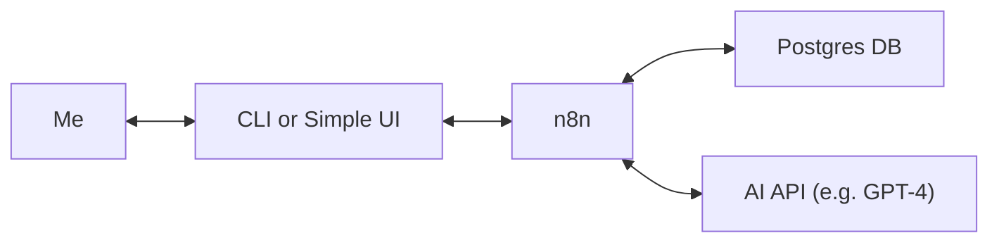

Lately, I’ve been thinking about using AI as my personal project manager — not in the corporate "meetings and reports" sense, but more like a quiet assistant that helps me stay on track while I build things solo.

The twist? I want to keep it **local**. No cloud dashboards, no SaaS clutter. Just me, my machine, and a few tools I already like: **n8n** and **Postgres**.

## Why Even Do This?

When you're a solo dev, it's really easy to:
- Drift from your original plan
- Work on the fun stuff instead of the important stuff
- Forget what you were doing last week

I don’t really want a full-blown PM tool. I just want something that:
- Helps me reflect each day
- Suggests what to work on next
- Keeps a history of what I’ve done
- Feels like a teammate, but quiet and useful

## The (Imaginary) Setup

This is just a thought experiment for now, but here’s how I imagine it working:

Everything happens locally except for the AI call, which could use OpenAI or Claude — or something self-hosted in the future.

## A Day in the Life (Maybe)

Here’s how I’d interact with this setup:

1. **Morning Check-In**
   - I tell it how I’m feeling and how much time I have.
   - It stores this in Postgres as a daily log.

2. **AI Suggests Tasks**
   - Based on my task list and mood, it says:
     > “You’ve got 90 mins. Maybe finish that login flow cleanup?”
   - It shows reasoning too, like a mini standup buddy.

3. **Task Updates**
   - I check off tasks, update priorities, or add new ones.
   - All saved locally in Postgres.

4. **Weekly Recap**
   - It pulls a summary of what I did and maybe suggests the next focus area.

## What Would Be Stored?

Simple tables in Postgres:
- `tasks`: title, status, priority
- `checkins`: mood, focus, time available
- `recommendations`: AI-generated suggestions with context

## Why Not Use Notion or Trello?

Honestly? I just want fewer tabs and more control. I already use n8n for automation, and Postgres is solid. With this setup, I could query my own data, automate things, and maybe even version control it.

Plus, building it sounds fun.

## Still Just an Idea

Nothing’s built yet. I’m still figuring out:
- What workflows make sense
- How often I’d actually use it
- Whether I want a CLI, a local web UI, or just n8n triggers

But the idea keeps coming back, so I might take a weekend to prototype something soon.

## What Do You Think?

If you’re also building solo or thinking about using AI for something beyond just writing code, I’d love to hear what you’d want from a setup like this.

Would you trust AI to suggest your next task? Do you already use something like this?

Let’s chat.